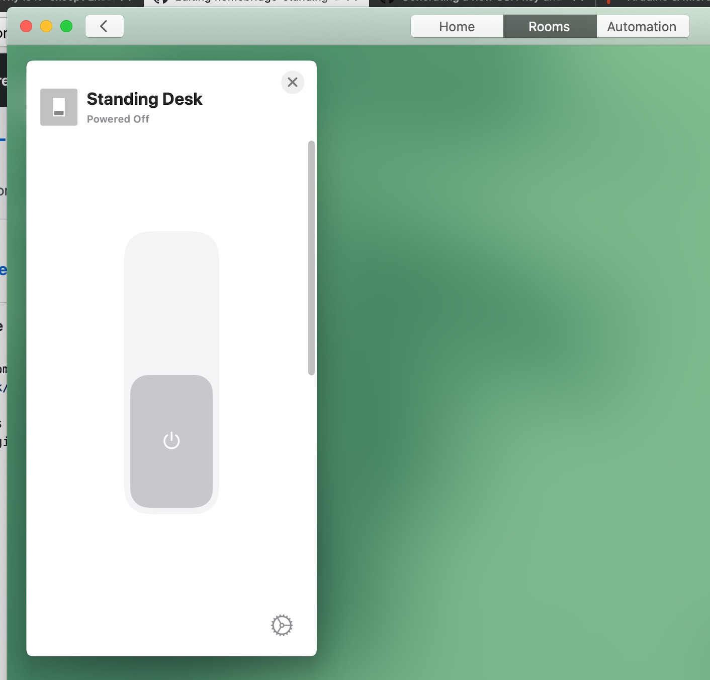

A homebridge plugin to allow control of my Conset 501-49 standing desk via [my Raspberry Pi standing desk controller](https://github.com/timmyomahony/standing-desk/). 

This plugin provides a switch Accessory with an on (i.e. "up") and off (i.e. "down") position that allows the raising and lowering of my desk via Home.app. The plugin doesn't handle any of the Raspberry Pi logic. Instead it simply sends a message to Redis.

## Installation 

TODO

## Todo:

- The homebridge plugin can't read the status of the table. It can only give commands. This means the table and the homebridge switch can get out of sync if I use the built-in display to raise/lower the table
